# Laporan Jobsheet 2

## Praktikum 1

1. Routing Hello World :
   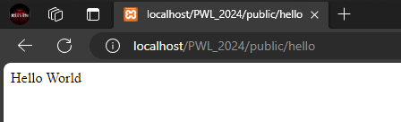
2. Routing World :
   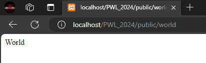

## Praktikum 2

1. Memanggil route /user/{name} :
   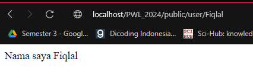
2. Route menerima parameter $postId dan juga $comment :
   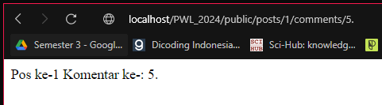

## Percobaan 3

1.  Memanggil route /user sekaligus mengirimkan parameter berupa nama user
    $name :
    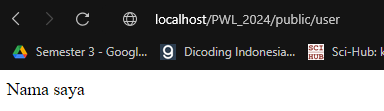

        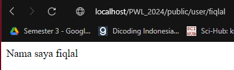

## Percobaan 4

1. Membuat controller pada Laravel dengan Artisan :
   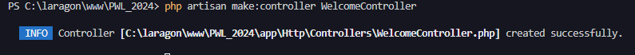
2. Buka file pada app/Http/Controllers/WelcomeController.php :
   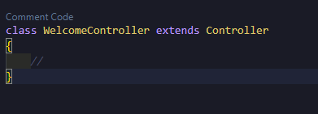
3. Tambahkan function dengan access public :
   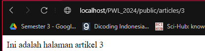
4. Tambahkan controller tersebut pada route :
   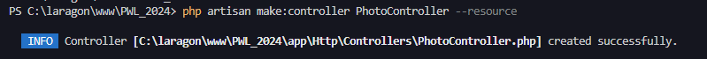

5. Buka browser, localhost/PWL_2024/public/hello :
   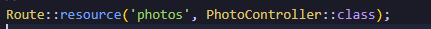

6. Tampilkan Pesan ‘Selamat Datang’ PageController : index :
   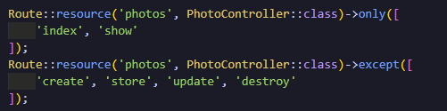

7. Tampilkan Nama dan NIM PageController : about :
   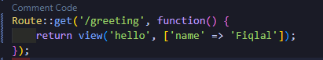

8. Tampilkan halaman dinamis ‘Halaman Artikel dengan Id {id}’ id diganti sesuai input dari url PageController : articles :

    

## Percobaan 5

1. controller dengan nama PhotoController yang berisi method method standar untuk proses CRUD :
   

2. buatkan route agar dapat terhubung dengan frontend :
   

3. update route pada web.php :
   

## Percobaan 6

1. Pada direktori app/resources/views, buatlah file hello.blade.php :
   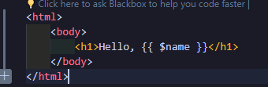
2. Route akan memanggil View sesuai dengan nama file tanpa ‘blade.php’ :
   
3. Jalankan code dengan membuka url localhost/PWL_2024/public/greeting :
   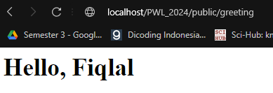

## Percobaan 7

1. Buatlah direktori blog di dalam direktori views & Pindahkan file hello.blade.php ke dalam direktori blog :
   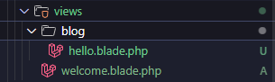
2. Lakukan perubahan pada route :
   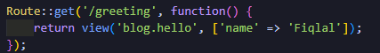
3. Jalankan code dengan membuka url localhost/PWL_2024/public/greeting :
   

## Percobaan 8

1. Buka WelcomeController.php dan tambahkan fungsi baru yaitu greeting :
   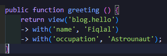
2. Ubah route /greeting dan arahkan ke WelcomeController pada fungsi greeting :
   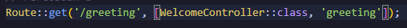
3. Ubah hello.blade.php agar dapat menampilkan dua parameter :
   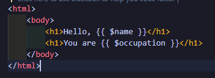
4. Jalankan code dengan membuka url localhost/PWL_2024/public/greeting. Perhatikan
   halaman yang muncul :  
    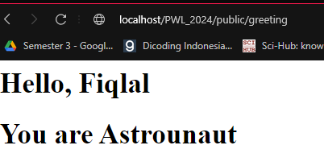

## Soal Praktikum

1. Jalankan Langkah-langkah Praktikum pada jobsheet di atas. Lakukan sinkronisasi
   perubahan pada project PWL_2024 ke Github.
2. Buatlah project baru dengan nama POS. Project ini merupakan sebuah aplikasi Point of Sales yang digunakan untuk membantu penjualan.
3. Buatlah beberapa route, controller, dan view sesuai dengan ketentuan sebagai berikut :
    - Halaman Home Menampilkan halaman awal website
    - Halaman Products Menampilkan daftar product (route prefix)
        - /category/food-beverage
        - /category/beauty-health
        - /category/home-care
        - /category/baby-kid
    - Halaman User Menampilkan profil pengguna (route param)
        - /user/{id}/name/{name}
    - Halaman Penjualan Menampilkan halaman transaksi POS
4. Route tersebut menjalankan fungsi pada Controller yang berbeda di setiap halaman.
5. Fungsi pada Controller akan memanggil view sesuai halaman yang akan ditampilkan.
6. Simpan setiap perubahan yang dilakukan pada project POS pada Git, sinkronisasi
   perubahan ke Github.
